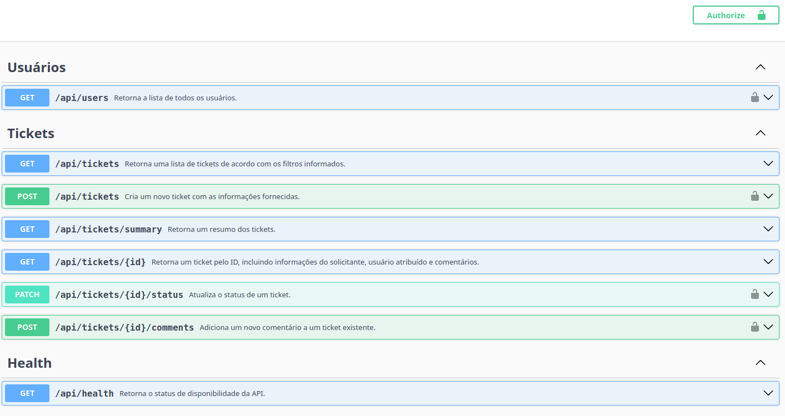

# Oxetech Helpdesk API

Esta é uma API REST para gerenciamento de chamados de suporte acadêmico, desenvolvida como parte do projeto da disciplina Engenharia de software da Oxetech Academy.  Ao longo do curso, a aplicação foi evoluída por meio de refatorações incrementais, melhorias na organização do código, implementação de testes automatizados e de integração, documentação da API e outras práticas de desenvolvimento de software. 

## Requisitos

### Execução local

- Node.js 20 ou superior
- npm

### Execução com Docker

- Docker

## Tecnologias

- Node.js
- TypeScript
- Express
- Jest
- Docker
- Swagger (OpenAPI)

## Estrutura do projeto 

src/
├── controllers/
├── middlewares/
├── routes/
├── services/
├── swagger/
├── tests/
├── app.ts
└── server.ts

- **controllers/**: recebem as requisições HTTP e retornam as respostas.
- **middlewares/**: implementam funcionalidades compartilhadas, como autenticação, autorização e validação de dados de entrada.
- **routes/**: definem os endpoints da API.
- **services/**: concentram a lógica de negócio da aplicação.
- **swagger/**: contém a configuração do Swagger e a documentação dos endpoints da API.
- **tests/**: contêm os testes automatizados e de integração.

## Funcionalidades

A API disponibiliza funcionalidades para gerenciamento de chamados de suporte acadêmico, incluindo:
- Gerenciamento de chamados de suporte acadêmico.
- Consulta de usuários cadastrados.
- Cadastro, consulta e atualização de chamados.
- Filtragem de chamados por critérios específicos.
- Validação dos dados recebidos nas requisições.
- Autenticação e autorização por níveis de acesso.
- Documentação interativa da API com Swagger.
- Endpoint para verificação da saúde da aplicação (Health Check).

## Testes

Para executar os testes automatizados e de integrações das principais rotas:

```bash
npm test
```

### Execução Local

Instale as dependências:

```bash
npm install
```

Recrie os dados de exemplo, se necessário:

```bash
npm run seed
```

Inicie a aplicação:

```bash
npm run dev
```

A API ficará disponível em:

```
http://localhost:3000/api
```

### Execução com Docker

Construa a imagem:

```bash
docker build -t oxetech-helpdesk-api .
```

Execute o contêiner:

```bash
docker run -p 3000:3000 oxetech-helpdesk-api
```

A API ficará disponível em:

```
http://localhost:3000/api
```


## Documentação da API

Após iniciar o servidor, acesse:

```
http://localhost:3000/api-docs
```

A API possui documentação interativa gerada com Swagger e permite:

- visualizar todos os endpoints;
- testar requisições diretamente pelo navegador;
- consultar parâmetros, request bodies e respostas da API



## Scripts

- `npm run dev`: inicia a aplicação em modo de desenvolvimento.
- `npm run seed`: recria os dados iniciais.
- `npm run typecheck`: verifica os tipos TypeScript.
- `npm run build`: compila a aplicação para `dist`.
- `npm test`: executa os testes automatizados e de integração.

